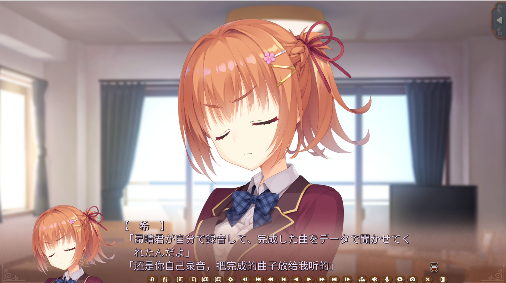
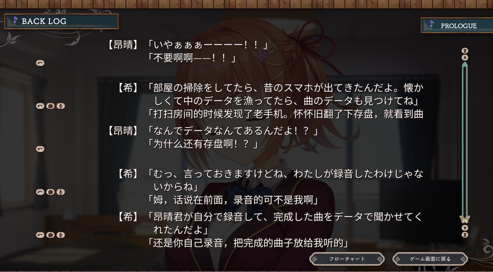

# Dual Subtitle Tool

English | [简体中文](README.zh-CN.md)

Dual Subtitle Tool is a small workflow repository for building bilingual in-game text patches for Kirikiri/KirikiriZ visual novels, especially games whose scenario scripts can be dumped and rebuilt through FreeMote-compatible M2/KRKR PSB JSON.

It is not a one-click universal patcher. The useful part is the repeatable pipeline:

1. Dump or extract decrypted scenario scripts.
2. Decompile scripts to editable JSON with FreeMote.
3. Extract original text rows.
4. Collect translated text rows from a localized build or patch.
5. Align original and translated rows.
6. Write bilingual text back into the scenario JSON.
7. Rebuild scenario files and pack a runtime XP3 patch.
8. Load the patch with KrkrPatch or another Kirikiri patch loader.

## Screenshots

In-game dialogue with bilingual lines:



Backlog view with bilingual history:



## What Is Included

- Python scripts for XP3 packing, FreeMote JSON text extraction, bilingual text injection, memory-string extraction, and alignment.
- PowerShell example for building and installing a patch archive.
- KrkrPatch example configuration.
- Documentation for the workflow and known limitations.

## What Is Not Included

- No game binaries.
- No extracted game scripts, resource packs, fonts, audio, save data, generated patches, or translation tables.
- No third-party binaries such as FreeMote, KrkrDump, KrkrPatch, or KrkrExtract.
- No translation data from any commercial game.

You must provide legally obtained game files and third-party tools yourself.

## Repository Layout

```text
scripts/
  xp3_pack.py                    Pack a simple unencrypted XP3 archive.
  xp3_replace_entry.py           Replace one uncompressed XP3 entry in-place.
  freemote_batch.py              Batch decompile/build FreeMote scenario files.
  freemote_extract_texts.py      Extract text rows from FreeMote scenario JSON.
  freemote_apply_bilingual.py    Append translated lines to FreeMote scenario JSON.
  freemote_align_json.py         Audit original/translated FreeMote JSON pairs and write bilingual JSON.
  align_memory_strings.py        Align translated memory strings to original rows.
  extract_cjk_strings.py         Extract CJK-looking strings from binary dumps.
  scan_process_cjk.py            Scan a Windows process for CJK strings.
  search_process_text.py         Search process memory for exact text terms.
  dump_process_region.py         Dump a readable process memory region.
  parse_krkrdump_log.py          Extract hash/path mappings from KrkrDump logs.

docs/
  WORKFLOW.md                    End-to-end workflow.
  SCRIPTS.md                     Script reference and command examples.
  LIMITATIONS.md                 Portability and risk notes.
  CAFE_STELLA_CASE_STUDY.md      Short sanitized case study from the prototype.

examples/
  build_patch.ps1                Generic patch build/install helper.
  krkrpatch/KrkrPatch.example.json
  scenario_map.example.tsv
  json_alignment_overrides.example.tsv
  alignment.example.tsv
```

## Quick Start

There are two supported alignment paths.

### Preferred: Direct JSON Alignment

Use this when the original and translated builds can both be decompiled to matching FreeMote JSON:

```powershell
python scripts\freemote_batch.py decompile --input-dir work\orig_scn --output-dir work\orig_json
python scripts\freemote_batch.py decompile --input-dir work\translated_scn --output-dir work\translated_json
python scripts\freemote_align_json.py --map work\scenario_map.tsv --orig-json-dir work\orig_json --translated-json-dir work\translated_json
python scripts\freemote_align_json.py --map work\scenario_map.tsv --orig-json-dir work\orig_json --translated-json-dir work\translated_json --write-bilingual-json --clean
python scripts\freemote_batch.py build --input-dir work\bilingual_json --output-dir work\bilingual_scn
```

Copy the rebuilt `.ks.scn` files and any per-game startup/font overrides into `work\patch_stage`, then pack:

```powershell
python scripts\xp3_pack.py work\patch_stage work\dual_sub_patch.xp3
```

### Fallback: Text Table Alignment

Use this when translated text comes from memory scanning or another table instead of translated scenario JSON:

```powershell
python scripts\freemote_extract_texts.py work\orig_json -o work\orig_texts.tsv
python scripts\align_memory_strings.py --orig work\orig_texts.tsv --mem-strings work\translated_strings.tsv -o work\aligned.tsv --log-output work\align_log.tsv
python scripts\freemote_apply_bilingual.py --input-json work\orig_json\scene.ks.json --alignment work\aligned.tsv -o work\bilingual_json\scene.ks.json
```

## How Text Is Embedded

The tool does not perform machine translation and does not draw an external overlay. It edits the scenario JSON text block itself:

```text
original line
```

becomes:

```text
original line
translated line
```

The rebuilt scenario is then loaded by the game as an ordinary script override.

See [docs/WORKFLOW.md](docs/WORKFLOW.md) for the full process and [docs/SCRIPTS.md](docs/SCRIPTS.md) for script-by-script usage.

## Current Maturity

This is alpha-quality tooling extracted from a successful full-scenario prototype. It is most useful when:

- the game is Kirikiri/KirikiriZ based;
- scenario files can be dumped or decompiled;
- FreeMote can rebuild the scenario format;
- translated text can be collected as an ordered text table;
- a runtime patch loader can override the scenario file.

Different engines or heavily customized script systems need additional adapters.
